## Инструкция по запуску:

### Установка окружения и пакетов

Установить пакетный менеджер uv: 
```pip install uv```

В корне проекта инициализировать uv: 
```uv init```

Создать виртуальное окружение: 
```uv venv```
 
Активировать виртуальное окружение: 
```source .venv/bin/activate``` 

или Windows:
```.venv\Scripts\activate.bat```

Установить зависимости:  
```uv pip install -r <(uv pip compile pyproject.toml)```

### Настройка .env 
Создать .env файл (см. шаблон env.example)

Зарегистрироваться и получить ключ на сайте: https://openrouter.ai

Добавить ключ в .env в переменную 
```OPENROUTER_API_KEY```

### Запуск и работа
Запустить проект: 
```uv run uvicorn app.main:app --reload --host 0.0.0.0 --port 8000```

Перейти по ссылке: http://0.0.0.0:8000/docs

Для выполнения сценариев раскрывать строку эндпоинта и нажимать try out
 
## Примеры работы: 

Общий экран swagger:

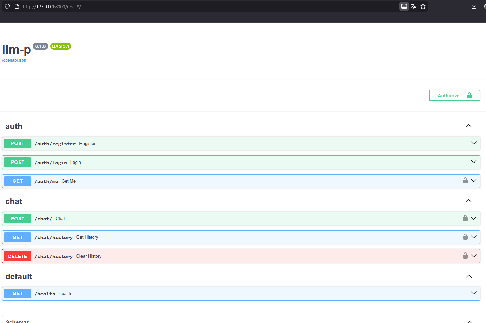

Регистрация: 

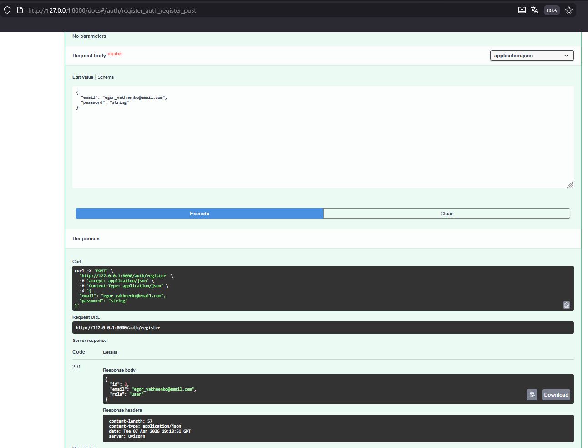

Логин и получение JWT:

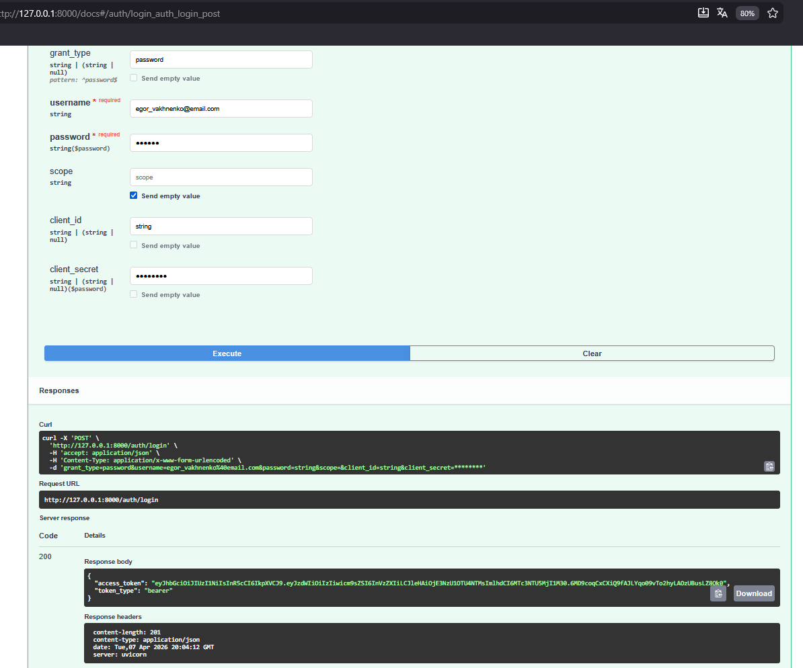

OAuth авторизация:

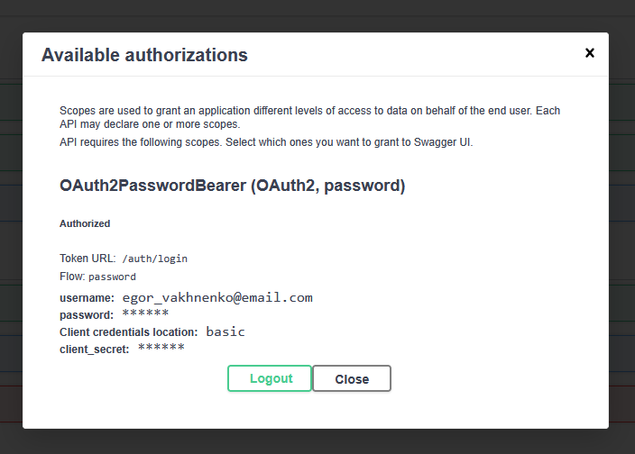

Вызов POST /chat:

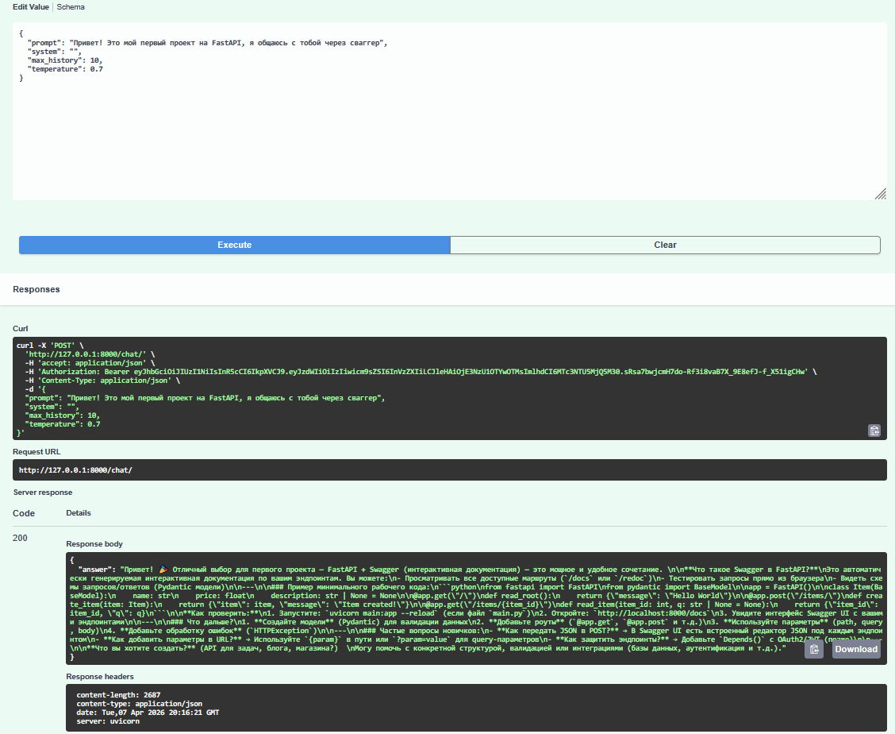

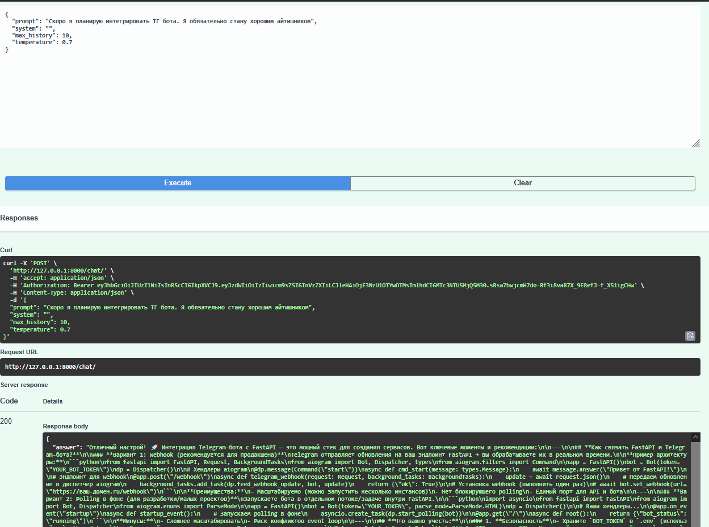

Вызов GET /chat/history:

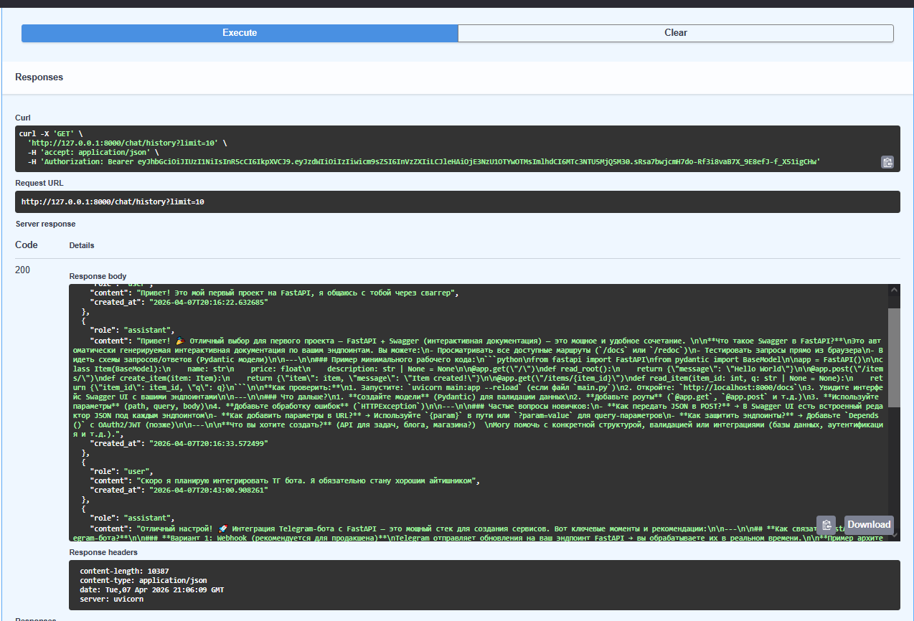

Вызов DELETE /chat/history:

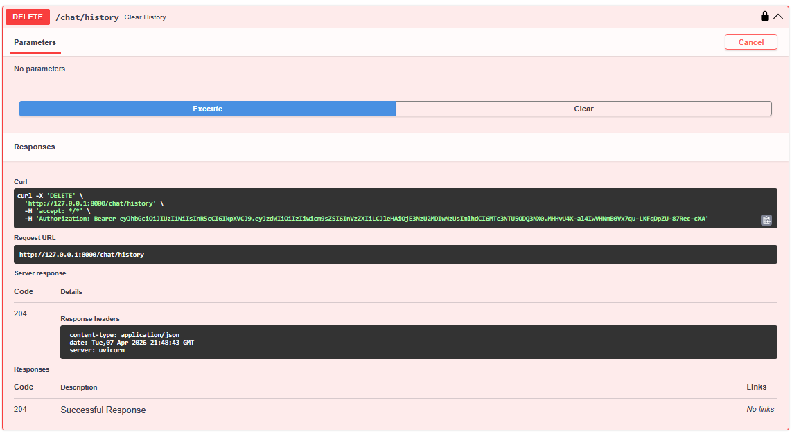

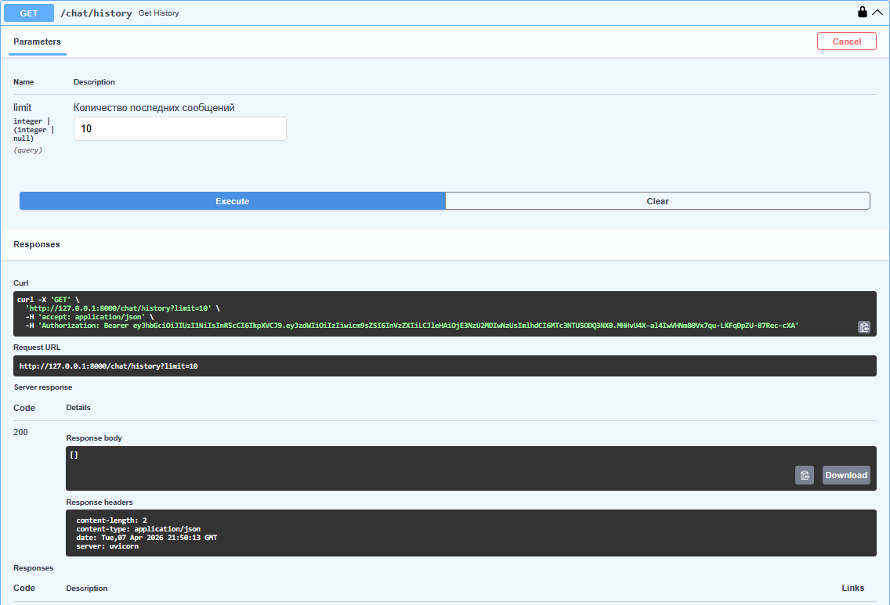

Вызов GET /health:

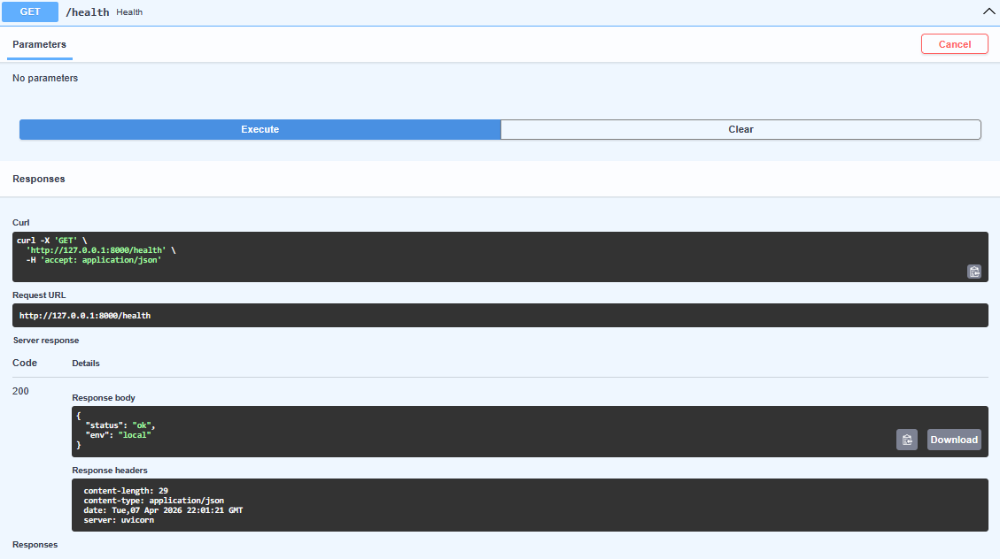

## Обработка специфичных сценарииев

**Защищённые эндпоинты недоступны без токена**

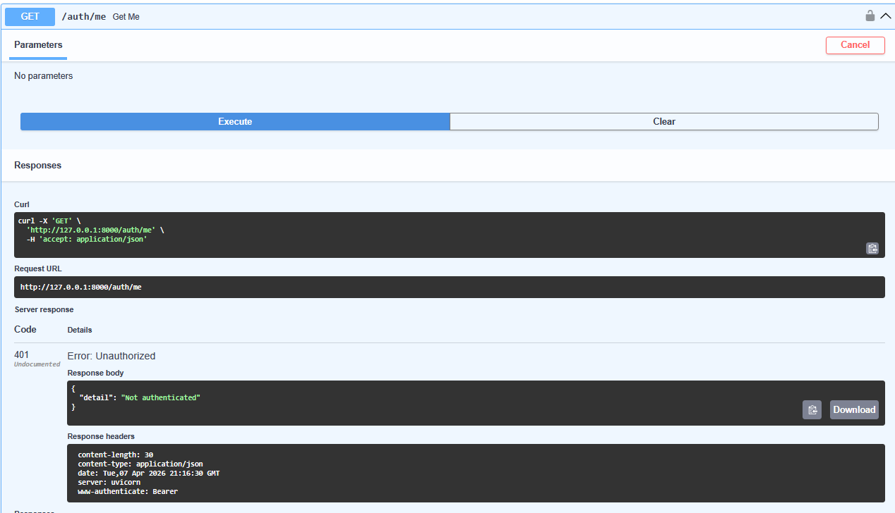

**Данные разных пользователей не смешиваются**

Логиним тестового юзера
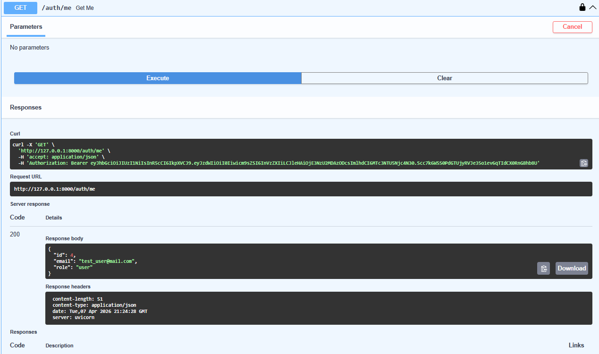

У тестового юзера есть свой диалог
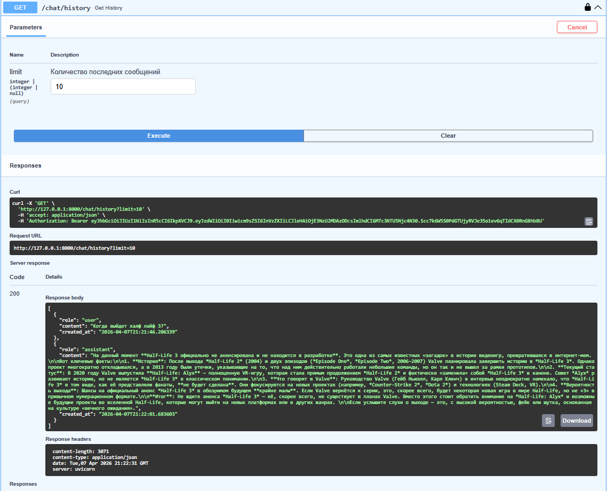

Логиним исходного юзера
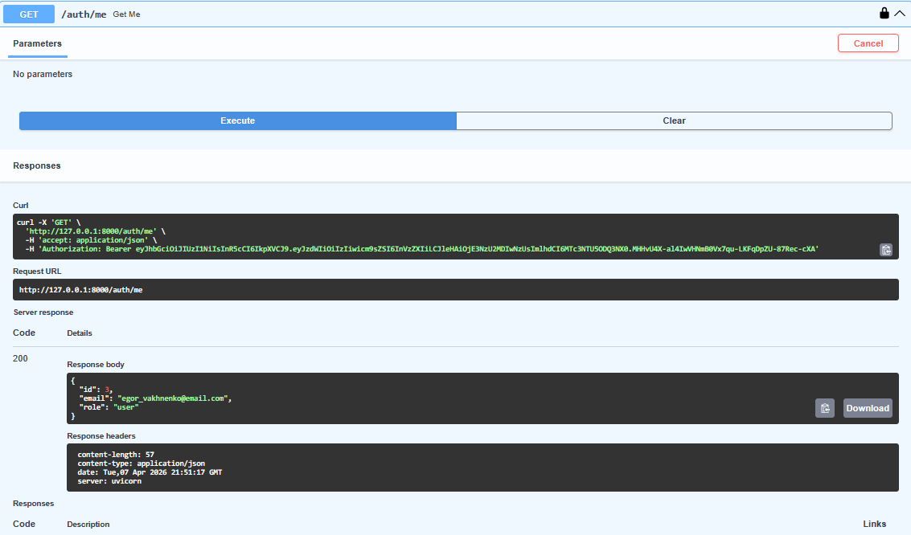

Исходный юзер имеет свою раннее очищенную историю и не подтягивает чужие сообщения
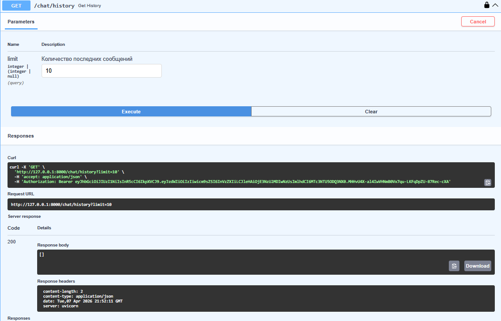
